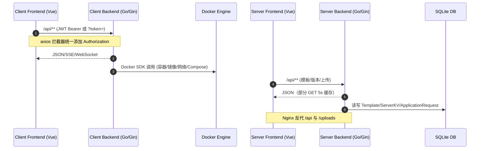
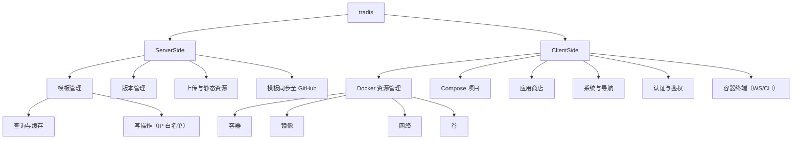

# 项目交互与代码分析（tradis）

- 仓库根路径：/home/cherry/tradis
- 技术栈分层：
  - 服务端（server）：Go + Gin + SQLite，前端 Vue（vite），Nginx 反代
  - 客户端（client）：BFF（Go + Gin）+ 前端 Vue（vite），直连本机 Docker API，含 SSE/WebSocket
- 结论先行：
  - server 与 client 为两套相互独立的系统；当前未发现 client 直接调用 server 的接口
  - client 前端通过 axios 拦截器统一鉴权；BFF 通过 JWT 中间件统一保护接口
  - server 对模板查询接口提供 5s 级别的响应缓存与 IP 级别速率限制；写接口使用 IP 白名单做“伪鉴权”
  - 终端多实现已部分清理（CLI 入口已移除）；前端仍存在 SSE 逻辑与样式定义重复

## 本轮执行进度
- 已完成：统一前端 SSE 事件流处理（Projects/ProjectDetail 切换到 sseLogStream）
- 已完成：合并暗色样式并清理重复引入（layout.css/main.js/App.vue）
- 已完成：统一前端认证请求入口（Login 改用 api.auth）
- 已完成：client/server 后端错误返回结构统一（code/message/details/error）
- 已完成：server/backend 管理接口白名单错误响应已接入统一结构
- 已完成：client/backend 配置 Trusted Proxies 避免 Gin 安全警告
- 已完成：修复 Docker Socket 访问失败的启动与连接配置
- 已完成：本地测试启动/停止统一使用 /home/cherry/tradis/start.sh 并增强权限校验
- 已完成：前端图标统一替换（AppSidebar/AppHeader/Compose/Navigation/Projects/AppDeploy/Ports/Settings/Login/ContainerEdit/ContainerLogs）
- 已完成：移除 client 前端 Element Plus 图标全局注册
- 已完成：修复前端 Element Plus size="medium" 控制台告警（统一改为 size="default"）
- 已完成：修复 Overview 事件映射函数闭合导致的构建错误
- 已完成：修复 Navigation mdi 图标渲染与 Overview 动态图标渲染
- 已完成：统一顶部栏与内容区左右对齐（缩小顶部栏左右内边距）
- 已完成：修复 AppHeader 与带 padding 页面左右对齐（顶部栏增加外边距）
- 已完成：整理第一类/第二类页面布局与按钮差异清单并输出 diff.md
- 已完成：详情页内容区滚动容器与按钮尺寸基线对齐
- 已完成：详情页按钮组样式对齐第一类页面按钮组表现
- 已完成：AppStore 安装次数与操作按钮同一行对齐
- 已完成：Settings 分类标签精简并收紧表单间距
- 已完成：镜像更新方案文档输出（镜像更新.md）
- 已完成：Settings 调整为左右两列卡片布局并整合端口管理
- 已完成：Settings 优化视觉效果（表单上下排列，平衡卡片内容）
- 已完成：修复 Compose 更新提醒显示（同步 updateAvailable 字段）
- 已完成：Compose 更新提醒补充从 compose 文件读取镜像
- 已完成：Compose 列表支持独立容器更新提醒
- 已完成：Compose 列表新增更新提醒列
- 已完成：Compose 列表移除名称列内重复的更新徽标
- 已完成：定位容器更新标记缺失原因为后端运行旧进程并完成重启生效
- 已完成：修复侧边栏新版本提醒的本地版本与提示条件
- 已完成：模板变量引用解析增强（支持 $VAR，覆盖 healthcheck/labels 等非 environment 区域）
- 已完成：AppStore 列表接口增加服务端缓存与条件请求（降低远端拉取频次）
- 已完成：AppStore 详情获取加入 TTL 缓存与条件请求（减少重复拉取）
- 已完成：AppDeploy 增加右侧变量栏并改为后端 vars 统一解析
- 已完成：AppDeploy schema 与 env 调整为左右布局（schema 左，env 右）
- 已完成：模板管理端改为后端解析 compose/schema/refs（新增 /templates/parse-vars）
- 已完成：变量解析加入输入大小与数量上限，避免异常模板拖垮进程
- 已完成：补齐 Client/Server 后端变量解析单测并通过构建验证
- 已完成：Server 端 MCP 批量导入接口与文档（支持 dryRun/自动解析）
- 已完成：Server 端动态白名单管理（ServerKV 存储 + 可视化弹窗）
- 已完成：Client 端全局 AI 配置与连接性测试（Settings + /api/ai/test）
- 已完成：AI Base URL 规则统一为仅追加 /chat/completions，并在设置页展示最终 URL
- 已完成：Client 端导航 AI 增强（Web 端口探测过滤 + AI 标记与补全）
- 已完成：AI 识别过程增加操作日志与手动触发接口，便于排查与回放
- 已完成：AI 识别日志复用通知模块在“消息中心”可视化展示
- 已完成：Client 端提供 MCP 受限接口用于导航图标目录与 icon 字段更新
- 已完成：导航图标上传增强支持更多图片格式，并同步 UI 提示
- 已完成：卷备份使用 docker-volume-backup 容器方案并接入设置页一键启用
- 已完成：卷备份增加本地归档目录预创建提醒，并增加每日备份 Cron 配置与文档链接
- 已完成：卷文件浏览器（临时容器 + 后端反代 filebrowser）并自动清理
- 已完成：卷浏览器支持 token Cookie 透传以解决静态资源 401
- 已完成：卷浏览器改写 /api 与 favicon 路径，修复免登录访问失败
- 已完成：卷浏览器自动销毁清理改为按 session 校验并周期清理
- 已完成：导航“重新识别”按钮联动触发 AI 强制重识别
- 已完成：AI enrich 前清理孤儿 auto 导航，避免容器不存在仍被识别
- 已完成：AI enrich 增加同 navId 并发锁，避免重复并发识别与竞态写入
- 已完成：端口探测增加延迟重试，避免容器刚启动即被误判隐藏
- 已完成：重识别期间抑制自动 AI enrich 与 backfill，避免重复识别噪音
- 已完成：AI enrich 批处理互斥，避免多路并发触发造成重复 start/done
- 已完成：导航删除语义明确为“隐藏”，并支持回收站内“彻底删除”
- 已完成：导航卡片新增“AI 重新识别”按钮（按 navId 定向触发）
- 已完成：AI 导航默认提示词优化为一轮输出 title/category/icon，避免部分写入
- 已完成：自动 AI 识别仅对新导航项首次补全（禁用启动时全量 backfill）
- 已完成：稳定性降载（容器列表高负载自动降载 + 概览页刷新自适应）
- 已完成：前端轮询统一切换标准（全局采集后端建议间隔并应用到多个页面）
- 已完成：统一更新项目内 .gitignore 与 .dockerignore 忽略规则
- 已完成：优化 upload_to_github.sh（参数化、SSH 权限与 Git 身份提示）
- 已完成：完善模板参数解析与 dotenv 统一方案（支持多 env_file 与 secrets）
- 已完成：模板变量方案落地（params 输出、secrets 写盘、固定落盘结构、前端高级模式门禁）
- 进行中：client 主题选项规划与样式分类清单（见 主题plan.md）
- 进行中：交互逻辑、前端重构与 CSS 优化全量扫描与清单化（新增优化机会如下）

## 新增优化机会（已确认并优化）
- **交互逻辑**：Overview 事件标签文案与类型已统一映射 [Overview.vue](file:///home/cherry/tradis/client/frontend/src/views/Overview.vue#L142-L167)
- **交互逻辑**：Overview 的 eventLogs 已按 maxEvents 截断并校正分页 [Overview.vue](file:///home/cherry/tradis/client/frontend/src/views/Overview.vue#L170-L206)
- **交互逻辑**：Overview 固定轮询已在不可见时暂停 [Overview.vue](file:///home/cherry/tradis/client/frontend/src/views/Overview.vue#L302-L343)
- **交互逻辑**：DockerDetail 定时刷新已加入可见性暂停与恢复 [DockerDetail.vue](file:///home/cherry/tradis/client/frontend/src/views/DockerDetail.vue#L449-L535)
- **前端重构**：formatBytes 已抽取到 utils 并复用 [format.js](file:///home/cherry/tradis/client/frontend/src/utils/format.js#L31-L41)
- **前端重构**：getLogClass 与 SSE URL 拼接已统一到 sseLogStream 工具层 [sseLogStream.js](file:///home/cherry/tradis/client/frontend/src/utils/sseLogStream.js#L15-L52)
- **前端重构**：ProjectDetail 日志自动滚动重复逻辑已移除 [ProjectDetail.vue](file:///home/cherry/tradis/client/frontend/src/views/ProjectDetail.vue#L707-L735)
- **后端重构**：Docker Client 创建与 SSE 错误输出已统一 [container.go](file:///home/cherry/tradis/client/backend/api/container.go#L24-L72)
- **CSS 优化**：filter-bar、pagination-bar、self-resource-alert 等公共样式在多页面重复 [Docker.vue](file:///home/cherry/tradis/client/frontend/src/views/Docker.vue#L678-L755) 与 [AppStore.vue](file:///home/cherry/tradis/client/frontend/src/views/AppStore.vue#L486-L560)
- **CSS 优化**：icon-wrapper 图标卡片样式在 Docker/Compose/Images 重复 [Docker.vue](file:///home/cherry/tradis/client/frontend/src/views/Docker.vue#L769-L799) 与 [Compose.vue](file:///home/cherry/tradis/client/frontend/src/views/Compose.vue#L1864-L1897)
- **CSS 优化**：状态指示器样式在 Compose 与全局布局重复且风格不一致 [Compose.vue](file:///home/cherry/tradis/client/frontend/src/views/Compose.vue#L1929-L1954) 与 [layout.css](file:///home/cherry/tradis/client/frontend/src/assets/css/layout.css#L268-L336)
- **CSS 规范**：第一类/第二类页面布局与按钮差异已形成基线文档 [diff.md](file:///home/cherry/tradis/diff.md)

## 目录结构
- server
  - backend（Go Gin，路由/中间件/SQLite）
    - [cmd/main.go](file:///home/cherry/tradis/server/backend/cmd/main.go)
    - [handlers/template.go](file:///home/cherry/tradis/server/backend/handlers/template.go)
    - [handlers/sync.go](file:///home/cherry/tradis/server/backend/handlers/sync.go)
    - [handlers/upload.go](file:///home/cherry/tradis/server/backend/handlers/upload.go)
  - frontend（Vue）
    - [src/api/template.ts](file:///home/cherry/tradis/server/frontend/src/api/template.ts)
  - 反代配置
    - [nginx.conf](file:///home/cherry/tradis/server/nginx.conf)
- client
  - backend（Go Gin，BFF）
    - [cmd/main.go](file:///home/cherry/tradis/client/backend/cmd/main.go)
    - api 路由：
      - 容器：[container.go](file:///home/cherry/tradis/client/backend/api/container.go)
      - 镜像：[image.go](file:///home/cherry/tradis/client/backend/api/image.go)
      - Compose：[compose.go](file:///home/cherry/tradis/client/backend/api/compose.go)
    - 终端（WebSocket）：[terminal.go](file:///home/cherry/tradis/client/backend/api/terminal.go)
      - 端口：[ports.go](file:///home/cherry/tradis/client/backend/api/ports.go)
      - 网络：[network.go](file:///home/cherry/tradis/client/backend/api/network.go)
      - 日志（SSE）：[logs.go](file:///home/cherry/tradis/client/backend/api/logs.go)
      - 认证：[auth.go](file:///home/cherry/tradis/client/backend/api/auth.go)
      - 导航：[navigation.go](file:///home/cherry/tradis/client/backend/api/navigation.go)
      - 应用商店（含 SSE）：[appstore.go](file:///home/cherry/tradis/client/backend/api/appstore.go)
  - frontend（Vue）
    - axios 封装：[utils/request.js](file:///home/cherry/tradis/client/frontend/src/utils/request.js)
    - API 聚合：[src/api/index.js](file:///home/cherry/tradis/client/frontend/src/api/index.js)
    - SSE 工具：[src/utils/sseLogStream.js](file:///home/cherry/tradis/client/frontend/src/utils/sseLogStream.js)

## 交互链路图


## 服务端（server）→ 客户端（client）请求-响应链路
- 发现：当前代码未显示 client（BFF/前端）直接调用 server；两端各自面向不同场景
- server 接口定义与路由映射（均在 /api 下）
  - GET /api/templates → handlers.ListTemplates(db)（限流+5s缓存）
  - GET /api/templates/:id → handlers.GetTemplate(db)（限流+5s缓存）
  - POST /api/templates/:id/deploy → handlers.IncrementTemplateDeploymentCount(db)
  - POST /api/applications → handlers.CreateApplicationRequest(db)（免认证，记录 IP/UA）
  - GET /api/version → handlers.GetServerVersion(db)
  - Admin（IP 白名单，见 adminIPAllowlistMiddleware）
    - POST /api/templates → handlers.CreateTemplate(db)
    - PUT /api/templates/:id → handlers.UpdateTemplate(db)
    - POST /api/templates/:id/enable → handlers.EnableTemplate(db)
    - POST /api/templates/:id/disable → handlers.DisableTemplate(db)
    - DELETE /api/templates/:id → handlers.DeleteTemplate(db)
    - POST /api/templates/sync → handlers.SyncTemplatesToGithubHandler(db)
    - POST /api/upload → handlers.UploadFile
    - PUT /api/version → handlers.UpdateServerVersion(db)
- 中间件与鉴权
  - CORS 允许所有来源与常见方法
  - IP 白名单：仅对“写接口”有效，替代鉴权
  - 访问日志：每日滚动文件，选路由/状态码/耗时过滤
  - 速率限制：固定窗口，按 IP 限 GET /templates*
  - GET 响应缓存：5s TTL，键包含 Method+Path+Query
- 输入/输出 DTO
  - Template/Variables、ServerKV、ApplicationRequest（见 [template.go](file:///home/cherry/tradis/server/backend/handlers/template.go#L87-L124)）
- 状态码与异常策略
  - 参数错误 400、白名单禁止 403、限流 429、内部错误 500、成功 200
  - 错误以 {code,message,details,error} 形式返回，少量成功返回包含业务字段
- 重试与缓存机制
  - 接口层缓存仅限 GET；可按需扩展 ETag/Last-Modified
  - Nginx 对静态资源长缓存；API 不缓存

## 客户端内部（client/backend ↔ client/frontend）
- BFF 路由与聚合
  - 认证：/api/auth/login、/api/auth/me、/api/auth/change-password；中间件 AuthMiddleware 支持 Header Bearer 与 ?token=
    - 参考 [auth.go](file:///home/cherry/tradis/client/backend/api/auth.go#L149-L202)
  - 容器：/api/containers/**（列表、详情、启动/停止/重启、日志、Stats、终端 WebSocket）
    - 参考 [container.go](file:///home/cherry/tradis/client/backend/api/container.go#L21-L45)
  - 镜像：拉取进度 SSE、代理配置、历史记录
    - 参考 [image.go](file:///home/cherry/tradis/client/backend/api/image.go#L520)
  - Compose：部署/启动/停止/重启/构建/状态/日志/SSE 事件
    - 参考 [compose.go](file:///home/cherry/tradis/client/backend/api/compose.go#L846-L874)
  - 端口：查询/分配/备注/范围设置
    - 参考 [ports.go](file:///home/cherry/tradis/client/backend/api/ports.go#L19-L28)
  - 网络/卷/导航/系统：对应 Register*Routes
  - 应用商店：公开列表与详情、受保护的部署与状态、SSE 任务事件
    - 参考 [appstore.go](file:///home/cherry/tradis/client/backend/api/appstore.go#L106-L132)
- 前端调用与拦截器
  - axios 基础封装：[request.js](file:///home/cherry/tradis/client/frontend/src/utils/request.js)
    - 自动添加 Authorization Bearer；FormData 自动移除 JSON 头；镜像拉取特殊 responseType/timeout
  - API 聚合入口：[index.js](file:///home/cherry/tradis/client/frontend/src/api/index.js)
    - containers/images/compose/ports/volumes/networks/system/navigation 等模块化调用
  - SSE 工具：[sseLogStream.js](file:///home/cherry/tradis/client/frontend/src/utils/sseLogStream.js)
    - 统一进度推断、自动滚动、失败重连提示；可复用到镜像/Compose/日志
- 共享类型/重复封装/冗余拦截器
  - 共享类型：后端以 Go 结构体为准；前端未集中定义 TS/JS 类型，建议统一类型源（OpenAPI/Swagger/生成 SDK）
  - 请求库重复：server/frontend 与 client/frontend 均独立创建 axios 实例（分别在 template.ts 与 request.js）
  - SSE 逻辑：Projects/ProjectDetail 的 EventSource 手写逻辑与 sseLogStream 重复
  - 样式定义重复：App.vue 全局样式与 layout.css 重复，dark.css 与 layout.css 存在重叠

## 接口-函数映射与可能瓶颈
- server（示例）
  - GET /api/templates → ListTemplates(db)（限流+缓存）
  - GET /api/templates/:id → GetTemplate(db)（限流+缓存）
  - POST /api/templates/sync → SyncTemplatesToGithubHandler(db)（外部 git 操作，I/O 与 CPU 可能偏重）
  - POST /api/upload → UploadFile（磁盘写入；存在覆盖行为）
- client（示例）
  - GET /api/containers → ListContainers（遍历 + 逐个 Inspect，规模大时可能高延迟）
  - GET /api/containers/:id/logs/events → getContainerLogsEvents（SSE，长连接；I/O 压力）
  - GET /api/containers/:id/stats/stream → streamContainerStats（SSE，持续解码统计，CPU/内存）
  - GET /api/appstore/tasks/:id/events → taskEvents（SSE；需考虑 Token 传递）
  - WebSocket 终端：/api/containers/:id/terminal、/api/containers/:id/exec（双实现）
- 调用频次与瓶颈标注（基于代码语义与常见使用场景的推断）
  - 高频：containers 列表/详情、logs/events、stats/stream、compose 任务事件、镜像拉取进度
  - 瓶颈：
    - 逐容器 Inspect（ListContainers + Inspect）：容器数量增多时显著放大延迟
    - 多 SSE 并发：日志/统计/任务事件同时开启会导致连接数与解析压力升高
    - 镜像拉取：长耗时 + 文本流解析；需要降噪与前端渐进式进度
    - server 的 Git 同步：外部进程与文件系统操作，需隔离限速与失败重试

## 静态分析（重复/相似/死代码）
- 重复/相似点（人工初筛）
  - 终端实现重复已收敛到 WebSocket TTY（CLI 路由与实现已移除）
  - axios 封装重复：server/frontend/src/api/template.ts 与 client/frontend/src/utils/request.js
    - 可抽取 monorepo 中的 shared/http 包，统一拦截器/重试/错误码
  - SSE 文本/JSON 处理：Projects/ProjectDetail 仍有手写 EventSource 逻辑，可统一使用 sseLogStream.js
  - 样式重复：App.vue 全局样式与 layout.css 重叠，dark.css 可合并到 layout.css
- 死代码/冗余
  - Compose 路由与任务管理内，老式 POST 构建/down/remove 兼容路径与新式路径并存，需规范化
- 建议落地的工具（在 CI 中执行）
  - jscpd：跨语言重复率扫描
  - dependency-cruiser：前端依赖环与层次约束（Vue 项目可配置）
  - @typescript-eslint：前端 TS/JS 规范（当前前端为 JS，可转 TS 或使用 eslint-config）
  - go vet + golangci-lint：Go 代码静态检查

## 风险等级评估
- 安全
  - JWT 允许 ?token= 作为 Query；易被日志泄漏或中间人截获，建议仅 Header 传递或签名一次性的 SSE ticket
  - CORS 全放开；建议白名单域名并限制 Credential
  - server 写接口用 IP 白名单代替鉴权；建议引入真正的认证与 RBAC
  - 上传接口存在覆盖保存逻辑；建议文件名加哈希/时间戳并做尺寸/类型校验
  - WebSocket 终端对目标容器权限边界需强化（避免访问保护容器）
- 性能
  - 逐容器 Inspect + Stats 流：在大规模环境下成为热点，建议分页、缓存、批量化
  - 多路 SSE/WS 并发：需连接数限流与后端聚合推送
  - server Git 同步：建议后台任务队列 + 断点续传/失败重试
- 维护性
  - 终端多实现与前端多 axios 实例带来维护成本与行为不一致
  - 缺少统一错误码与 SDK，类型约束不足

## 交互树（函数签名粒度）
```mermaid
graph TD
  subgraph Server(API)
    A1[/GET /api/templates/] --> A1F[ListTemplates(db)]
    A2[/GET /api/templates/:id/] --> A2F[GetTemplate(db)]
    A3[/POST /api/templates/sync/] --> A3F[SyncTemplatesToGithubHandler(db)]
    A4[/POST /api/upload/] --> A4F[UploadFile]
    A5[/GET /api/version/] --> A5F[GetServerVersion(db)]
  end

  subgraph Client(BFF)
    B1[/GET /api/containers/] --> B1F[ListContainers]
    B2[/GET /api/containers/:id/] --> B2F[GetContainer]
    B3[/GET /api/containers/:id/logs/events/] --> B3F[getContainerLogsEvents]
    B4[/GET /api/containers/:id/stats/stream/] --> B4F[streamContainerStats]
    B5[/WS /api/containers/:id/terminal/] --> B5F[containerTerminal*]
    C1[/GET /api/compose/deploy/events/] --> C1F[deployEvents]
    C2[/GET /api/appstore/tasks/:id/events/] --> C2F[taskEvents]
  end
```

## 逻辑树（业务语义层级）


## 重复率与初步统计（jscpd@3）
- 总体重复率：5.74%（阈值 5% 未通过，Found 120 clones）
- 语言级别重复率：
  - Go：8.84%（行）；9.52%（token）
  - Markup：4.19%
  - JavaScript：0.99%
  - JSON：20%
- 代表性重复片段（节选）
  - client/backend/api/container.go ↔ client/backend/api/volume.go（Docker Client 初始化与错误处理）
  - client/backend/api/auth.go 内部重复（请求校验逻辑）
  - client/frontend/package.json ↔ server/frontend/package.json（脚手架相似）
  - client/frontend/index.html ↔ server/frontend/index.html（Vite 模板）

---
以上为当前仓库的结构性梳理与交互链路可视化。后续将基于此分析制定可落地的重构与测试方案，确保行为契约不变、性能与安全达标。
